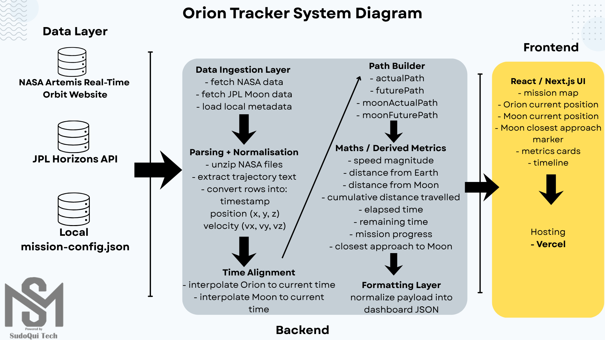

# OrionTracker

OrionTracker is a Next.js dashboard for visualizing the Artemis II mission using official Orion trajectory data and JPL lunar ephemeris data. It processes mission vectors into a clean engineering-style interface that shows Orion’s path, Moon geometry, mission metrics, and timeline.

  

## Overview

OrionTracker combines backend data ingestion, trajectory processing, and frontend visualization to display:

- Orion flown path
- Orion current position
- Forward path within the available ephemeris window
- Moon motion and geometry
- Mission metrics
- Timeline and milestone context

## Data Sources

- **NASA Artemis Real-Time Orbit Website**  
  Orion trajectory, ephemeris, and state vectors

- **JPL Horizons API**  
  Moon ephemeris and vector data

- **Local `mission-config.json`**  
  Labels, milestones, and UI metadata

## Architecture

- **Frontend:** React / Next.js UI
- **API route:** `src/app/api/dashboard/route.ts`
- **Data layer:** `src/lib/data/mission.ts`
- **Math layer:** `src/lib/math/trajectory.ts`
- **Formatting layer:** `src/lib/formatting/format.ts`

The frontend requests `/api/dashboard`, the backend fetches official data, processes it, computes derived metrics, and returns normalized dashboard JSON.

## Processing Pipeline

1. Fetch Orion ephemeris data from NASA
2. Fetch Moon vectors from JPL Horizons
3. Load local mission metadata
4. Parse state vectors into timestamped position and velocity records
5. Interpolate Orion and Moon to the current time
6. Build historic and future path segments
7. Compute derived mission metrics
8. Return formatted JSON to the frontend

### Parsed State Format

- `timestamp`
- `position = (x, y, z)` in km
- `velocity = (vx, vy, vz)` in km/s

### Path Outputs

- `actualPath`
- `futurePath`
- `moonActualPath`
- `moonFuturePath`

## Engineering Calculations

### Speed magnitude

$$
|\vec{v}| = \sqrt{v_x^2 + v_y^2 + v_z^2}
$$

### Distance from Earth

$$
d_{Earth} = \sqrt{x^2 + y^2 + z^2}
$$

### Distance from Moon

$$
d_{Moon} = \sqrt{(x - x_m)^2 + (y - y_m)^2 + (z - z_m)^2}
$$

### Cumulative distance travelled

$$
D_{cum} = \sum_{i=1}^{n} \|P_i - P_{i-1}\|
$$

where

$$
\|P_i - P_{i-1}\| = \sqrt{(x_i - x_{i-1})^2 + (y_i - y_{i-1})^2 + (z_i - z_{i-1})^2}
$$

### Elapsed time

$$
t_{elapsed} = t_{now} - t_{launch}
$$

### Remaining time

$$
t_{remaining} = t_{end} - t_{now}
$$

### Mission progress

$$
Progress\% = \frac{t_{now} - t_{launch}}{t_{end} - t_{launch}} \times 100
$$

### Closest approach to the Moon

$$
d_i = \|O_i - M_i\|
$$

$$
d_{min} = \min(d_i)
$$

## Frontend Outputs

- Mission map
- Orion current position
- Orion flown and future path
- Moon current position
- Moon historic and future path
- Closest approach marker
- Metrics cards
- Timeline

## Hosting

OrionTracker is designed for deployment on **Vercel**, which supports both the Next.js frontend and server-side API execution used for data fetching and processing.

## Notes

- The dashboard only shows data available in the current official ephemeris window
- Moon and Orion paths are time-aligned to avoid misleading geometry
- Local metadata is used for labels and milestones, not telemetry
- Accuracy depends on the availability and quality of official source data
